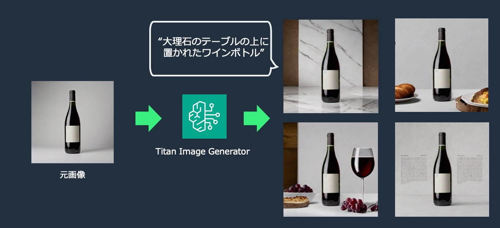

# Image Background Removal and Editing with Amazon Bedrock
This project leverages Amazon Bedrock's Titan Image Generator to enable background-only image generation for an original image. It automatically generates a mask to ensure that the subject of the original image remains unaffected by the prompt. Using the Inpainting feature of the Titan Image Generator, it generates the parts of the image outside the mask.

Amazon Bedrock の Titan Image Generator を利用して、元画像の背景のみ画像生成を行うことを可能にします。元画像の被写体にはプロンプトの影響が及ばないように、自動的にマスク生成を行っており、Titan Image Generator の Inpaint 機能で、マスク部分以外の生成を行っています。



## 機能

- マスク画像の生成: [rembg](https://github.com/danielgatis/rembg)ライブラリを使用して画像から背景を削除し、マスク画像を生成します
- 画像生成: Amazon Bedrock の Titan Image Generator モデルを使用して、ユーザーが入力したプロンプトに基づいて画像を編集します（プロンプトは Amazon Translate によって英訳されるため、日本語で指定可能です）

## Requirements
```
python = ">=3.11,<3.12"
```

## Installation

poetry で環境構築が可能です。

```
poetry install
```

## Usage

環境構築後、以下のコマンドで実行できます
```
poetry run python main.py 
```

main.py の以下の部分について、修正したい画像のパスや、出力先のパスなどを適宜修正してください。

```
if __name__ == "__main__":

    # 背景を修正したい画像のパスを指定
    input_path = './src/wine.png'

    # 修正後の画像の出力パスを指定
    output_path = './src/generated_wine.png'

    # 生成したい画像の説明を指定（日本語でもOK）
    # 例: "A realistic photo of wine bottle placed on marble floors"
    # 例: "プロのカメラマンが撮影した商品画像、大理石のテーブルの上に果物がたくさん置いてある、背景は少しボケている"
    prompt = "プロのカメラマンが撮影した商品画像、大理石のテーブルの上に、たくさんの果物が置かれている、背景は少しボケている"
    
    # ネガティブプロンプトを指定
    negative_prompt = "lowres, error, cropped, worst quality, low quality, jpeg artifacts, ugly, out of frame"

    main(input_path, output_path, prompt, negative_prompt)
```